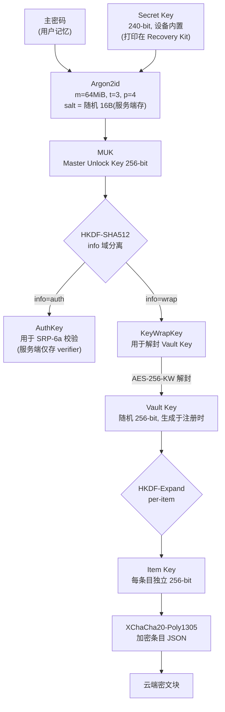

# VaultOne（代号）— MVP 开发计划书

> **[已归档 · 历史参考]** 本文为立项计划书，其技术选型（Tauri 桌面 / Go 服务端 / 原生移动端 / 国密套件等）与当前实现**不符**。
> **不依照其技术选型**；实际架构以 [docs/01](../01-模块拆分与依赖选型.md) 与代码为准，功能排期见 [docs/09](../09-passmgr功能对照与新版开发计划.md)。


| 项 | 内容 |
|---|---|
| 文档版本 | v1.0 |
| 日期 | 2026-09-23 |
| 产品代号 | VaultOne（正式名待定） |
| 文档性质 | MVP 立项与执行计划（可评审、可排期、可验收） |
| 目标周期 | 20 周（约 5 个月） |
| 目标人力 | 9 人核心团队，约 45 人月 |
| 预算区间 | ¥220 万 ~ ¥260 万（国内一线城市自研，含合规与安全测试） |

---

## 1. 产品定位与目标用户

### 1.1 一句话定位

**数字资产的本地优先保险库**：口令、账号、TOTP、密钥全部在用户设备上加密，云端只存密文——"服务器被拖库，也解不开任何一个密码"。

### 1.2 差异化切入点

1Password / Bitwarden 的功能已成熟，正面拼功能无胜算。MVP 只打三个点：

| 差异化维度 | 具体做法 | 为什么能赢 |
|---|---|---|
| **合规双栈** | 国内版支持 SM4-GCM / SM3-HMAC / SM2（商用密码），海外版 AES-256-GCM / Argon2id；同一内核，算法套件可切换 | 政企、金融、涉密单位采购的硬门槛；1Password 不满足 |
| **本地优先 + 国产生态适配** | 本地 SQLite 为唯一真相源，断网全功能可用；针对国内 Top 500 站点（政务、银行、企业内网、微信/支付宝网页版）做填充适配库 | 国际产品在国内长尾站点填充失败率高 |
| **透明可审计** | 客户端加密内核开源（AGPL），发布可复现构建 + SBOM + 签名 | 安全产品的信任成本极高，开源是最便宜的信任来源 |

### 1.3 目标用户（按优先级）

| 优先级 | 用户群 | 规模画像 | 核心诉求 | MVP 是否覆盖 |
|---|---|---|---|---|
| P0 | 数字安全敏感的个人用户（技术从业者、运维、金融从业者） | 25-45 岁，跨 3+ 设备，已用或愿付费 | 零知识、自动填充准确率、跨端同步 | ✅ 覆盖 |
| P1 | 10-50 人中小团队（研发/设计/外包公司） | 共享账号、入职离职交接 | 共享保险库、账号回收、审计日志 | ⚠️ 仅预留数据模型，功能延后 |
| P2 | 政企/金融合规采购 | 需等保、商用密码认证 | 国密算法、私有化部署、审计 | ❌ MVP 不做，作为 V2 商业化主线 |

### 1.4 明确不做（MVP 边界）

- 不做 Passkey / WebAuthn 凭据管理（V1.1）
- 不做团队共享、SSO/SCIM、企业目录集成（V2）
- 不做文件/证件图片存储（V1.2）
- 不做浏览器内置密码导入以外的迁移工具生态
- 不做 Linux 桌面端（用户占比低，ROI 不划算）

---

## 2. 核心功能范围（MVP）

### 2.1 P0 功能清单（Must have，缺失即不可发布）

| 编号 | 功能 | 范围说明 | 验收要点 |
|---|---|---|---|
| F-01 | 账号体系与注册 | 邮箱注册、设备指纹绑定、邮箱验证；新增设备需已登录设备批准或邮箱 OTP | 换新设备登录必须二次验证，无法绕过 |
| F-02 | 主密码与解锁 | 主密码 + 设备内置 Secret Key（240-bit）双因子派生；支持生物识别（Touch ID / Windows Hello / Face ID）快速解锁；自动锁定（空闲 10 min / 锁屏 / 休眠） | 主密码错误不产生任何可用的服务端信息；Secret Key 丢失后新设备无法解密 |
| F-03 | 保险库与加密存储 | 条目级加密（每条目独立密钥），本地 SQLite 加密库；条目类型：登录、信用卡、安全笔记、身份信息 | 磁盘文件中检索不到任何明文串（含 URL、用户名） |
| F-04 | 密码生成器 | 随机密码（长度 8-64、字符集可配、排除易混字符）+ 口令短语（3-8 词）；内置弱密码与重复使用检测 | 使用 CSPRNG，同种子不可预测；生成 100 万次无重复 |
| F-05 | 自动填充 | 浏览器扩展（Chrome / Edge，MV3）：站点匹配、一键填充、保存/更新提示、TOTP 自动复制；移动端：iOS AutoFill Credential Provider + Android AutofillService | Top 1000 站点填充成功率 ≥ 98% |
| F-06 | 跨设备同步 | E2EE 增量同步（变更日志 + 游标），冲突按"最新修改 + 保留历史版本"处理；离线队列，联网后自动补传 | 端到端同步 P95 < 3 s；弱网/断网 24 h 后数据无丢失、无重复 |
| F-07 | 2FA / TOTP | 条目内 TOTP 生成（SHA1/256/512，6/8 位，30/60 s），支持扫码与手输；TOTP 密钥与密码同级加密 | 与 Google Authenticator 校验一致（±1 窗口） |
| F-08 | 恢复机制 | 注册时强制下载 Recovery Kit（含 Secret Key + 恢复码）；服务端仅存恢复密钥密文 | 清空设备后可用 Recovery Kit 恢复全部数据 |
| F-09 | 安全审计与告警 | 登录/新增设备/主密码变更邮件通知；本地弱密码、重复密码、泄露密码（k-匿名前缀查询）报告 | 泄露检测不上传完整哈希前缀以外任何信息 |
| F-10 | 客户端安全机制 | 剪贴板 30 s 自动清空并标记敏感；截图防护（移动端 FLAG_SECURE）；内存零化（zeroize + 禁 swap） | 剪贴板残留检测通过；进程内存 dump 无长期驻留明文 |

### 2.2 P1 功能（Should have，进度允许时纳入）

- 浏览器扩展 Firefox 版本
- 从 Chrome / LastPass / Bitwarden / 1Password 导入（CSV + 1PIF）
- 条目版本历史（保留 30 天，可回滚）
- 紧急联系人（Emergency Access）
- 桌面端全局快捷键唤起（Spotlight 式快速搜索）

### 2.3 平台范围

| 平台 | MVP 深度 | 说明 |
|---|---|---|
| Windows 10/11 | 完整 | Tauri 桌面端，系统托盘、Windows Hello |
| macOS 12+ | 完整 | Touch ID、Keychain 集成 |
| Chrome / Edge 扩展 | 完整 | MV3，通过 Native Messaging 调用桌面端完成解密（避免在扩展进程长期持有密钥） |
| iOS 15+ | 精简 | 只读浏览 + 创建 + AutoFill 扩展；不做 TOTP 扫码以外的编辑 |
| Android 9+ | 精简 | 同上，AutofillService + Accessibility 兜底 |

---

## 3. 技术架构与安全方案

### 3.1 总体架构

```
┌──────────── 客户端（信任域，明文只在此域内存在） ────────────┐
│  桌面端(Tauri/Rust) │ 浏览器扩展(TS, 无密钥) │ 移动端(Swift/Kotlin) │
│                      │                        │                      │
│        └──── 共享加密内核 vault-core (Rust, 编译为 .dll/.so/.wasm/.aar/.xcframework) ────┘
│                          本地 SQLite（SQLCipher 加密）  ← 唯一真相源
└───────────────────────────────┬──────────────────────────────┘
                                │ 仅传输密文 + 元数据（TLS 1.3 + 证书固定）
┌───────────────────────────────▼──────────────────────────────┐
│  边缘：CDN / WAF / DDoS 防护 / 速率限制                         │
│  API 网关（Go）：认证、鉴权、限流、审计埋点                       │
│  服务层：                                                │
│    - auth-svc  账号、SRP-6a 校验、设备管理、2FA                 │
│    - sync-svc  变更日志、增量拉取、冲突裁决、批量下发              │
│    - blob-svc  密文对象存储（S3 兼容 / MinIO，服务端加密静态存储）  │
│    - notify-svc 邮件/推送告警                                  │
│  数据层：PostgreSQL 16（仅元数据 + 密文块）、Redis 7（会话/限流）、S3 │
└──────────────────────────────────────────────────────────────┘
```

**核心原则**：服务端**永远不接收主密码、Secret Key、任何明文条目字段**。服务端能看到的最多只有：邮箱、KDF 参数、盐、密文块、条目数量、时间戳、字节长度。长度泄露通过条目级 padding 缓解（密文对齐到 256 字节块）。

### 3.2 密钥层级与密码学方案（关键设计，评审重点）



**算法套件（双栈，编译期 + 配置期可切换）**

| 用途 | 国际套件（默认） | 国密套件（国内发行版） |
|---|---|---|
| 主密钥派生 | Argon2id (m=64MiB, t=3, p=4) | Argon2id 同参（KDF 无国密对应，仍需高内存硬度） |
| 对称加密 | XChaCha20-Poly1305 / AES-256-GCM | SM4-GCM |
| 哈希 / MAC | SHA-512 / HMAC-SHA256 | SM3 / HMAC-SM3 |
| 密钥封装 | AES-256-KW | SM2 公钥加密封装 |
| 传输 | TLS 1.3 + X25519 | TLS 1.3（SM2 双证书可选） |
| 签名（发布物） | Ed25519 | SM2 |

**关键安全设计点**

| 编号 | 设计 | 理由 |
|---|---|---|
| S-01 | 主密码**从不**上传，认证走 SRP-6a | 服务端被拖库无法拿到可离线爆破的密码哈希 |
| S-02 | 引入设备内置 Secret Key 与主密码共同派生 | 主密码熵通常仅 30-40 bit，单靠它无法抵抗离线爆破；Secret Key 补足到 240 bit |
| S-03 | 条目级独立密钥 + 每密钥独立 nonce | 避免跨条目 nonce 复用，限制单条泄露影响半径 |
| S-04 | 密钥仅在 Rust 内存中，`zeroize` + `VirtualLock/mlock` 防换页 | 防止内存 dump 与 swap 文件残留 |
| S-05 | 浏览器扩展进程**不持有** Vault Key，解密由桌面端 Native Messaging 代理 | MV3 扩展环境进程隔离弱、易被其他扩展读取 |
| S-06 | 自动填充不做键盘模拟，走 DOM 直接赋值 + 严格 eTLD+1 同源校验 | 防键盘记录器；防跨域钓鱼站点诱导填充 |
| S-07 | 服务端所有 API 幂等 + 版本号乐观锁 | 多设备并发写不产生静默覆盖 |
| S-08 | 密码变更时对 Vault Key 重新封装，条目密文不重加密 | 变更主密码在秒级完成，不触碰海量数据 |

### 3.3 技术选型

| 层 | 选型 | 备选 | 理由 |
|---|---|---|---|
| 加密内核 | Rust 1.8x + `uniffi`/`wasm-bindgen` | Go / C++ | 内存安全 + 无 GC 拷贝明文 + 一次编写五端复用 |
| 桌面端 | Tauri 2.0（Rust + WebView2/WKWebView） | Electron | 包体 <15 MB、无 Node 运行时、Rust 内核同进程调用 |
| 浏览器扩展 | TypeScript + MV3 + Native Messaging | 独立 WASM 解密 | 密钥不落在扩展进程 |
| 移动端 | Swift（iOS）+ Kotlin（Android），调用 Rust xcframework/.aar | React Native | 系统级 AutoFill 扩展必须原生 |
| 后端 | Go 1.22（net/http + chi） | Node/NestJS | 服务端逻辑极薄（只搬密文），Go 部署简单、内存占用低 |
| 数据库 | PostgreSQL 16（元数据） | — | 事务 + 行级安全策略 |
| 对象存储 | S3 兼容（云厂商 OSS/COS 或自建 MinIO） | — | 密文块便宜、可扩展 |
| 缓存 / 会话 | Redis 7 | — | 限流、会话、设备在线状态 |
| 本地存储 | SQLite + SQLCipher | — | 本地库整体加密，防文件系统级窃取 |
| 基础设施 | Kubernetes + Terraform，多可用区 | 单机 Docker Compose（内测期） | 后期合规与扩容 |
| CI/CD | GitHub Actions + 可复现构建 + cosign 签名 + SBOM(Syft) | — | 供应链安全，安全产品必备 |

---

## 4. 数据模型

### 4.1 服务端（PostgreSQL）— 全部字段标注是否含明文

```sql
-- 账号：仅邮箱与 KDF 元数据，无任何密钥
CREATE TABLE users (
  id              UUID PRIMARY KEY DEFAULT gen_random_uuid(),
  email_enc       BYTEA NOT NULL,              -- 邮箱（应用层加密，用于展示）
  email_hash      BYTEA NOT NULL UNIQUE,       -- HMAC-SHA256(邮箱, 服务端秘钥)，用于登录查找
  kdf_params      JSONB NOT NULL,              -- {"alg":"argon2id","m":65536,"t":3,"p":4,"salt":"b64"}
  srp_verifier    BYTEA NOT NULL,              -- SRP-6a verifier，不可逆
  srp_salt        BYTEA NOT NULL,
  mfa_type        TEXT,                        -- NULL | 'totp'
  mfa_secret_enc  BYTEA,
  status          TEXT NOT NULL DEFAULT 'active', -- active|locked|deleted
  created_at      TIMESTAMPTZ NOT NULL DEFAULT now(),
  updated_at      TIMESTAMPTZ NOT NULL DEFAULT now()
);

-- 设备：Secret Key 由设备本地生成，服务端只存设备公钥
CREATE TABLE devices (
  id            UUID PRIMARY KEY DEFAULT gen_random_uuid(),
  user_id       UUID NOT NULL REFERENCES users(id) ON DELETE CASCADE,
  name          TEXT NOT NULL,                 -- 用户可见设备名（用户自填，非指纹）
  platform      TEXT NOT NULL,                 -- windows|macos|ios|android|extension
  pub_key       BYTEA NOT NULL,                -- Ed25519（设备批准签名）
  approved_by   UUID,                          -- 批准该设备的 device_id
  approved_at   TIMESTAMPTZ,
  last_seen_at  TIMESTAMPTZ,
  revoked_at    TIMESTAMPTZ,
  created_at    TIMESTAMPTZ NOT NULL DEFAULT now()
);

-- 保险库：MVP 每人一个个人库；表结构预留共享场景
CREATE TABLE vaults (
  id            UUID PRIMARY KEY DEFAULT gen_random_uuid(),
  owner_id      UUID NOT NULL REFERENCES users(id),
  kind          TEXT NOT NULL DEFAULT 'personal', -- personal|shared
  name_enc      BYTEA NOT NULL,                -- 库名密文
  vk_wrap       BYTEA NOT NULL,                -- Vault Key 被 KeyWrapKey 封装后的密文
  vk_gen        INT NOT NULL DEFAULT 1,        -- 密钥代次，变更主密码时 +1
  created_at    TIMESTAMPTZ NOT NULL DEFAULT now()
);

-- 条目：服务端只见密文块与版本，不识内容
CREATE TABLE items (
  id            UUID PRIMARY KEY DEFAULT gen_random_uuid(),
  vault_id      UUID NOT NULL REFERENCES vaults(id) ON DELETE CASCADE,
  kind          TEXT NOT NULL,                 -- login|card|note|identity（用于客户端过滤，非敏感）
  blob          BYTEA NOT NULL,                -- 条目密文信封（含 item key wrap）
  blob_bytes    INT NOT NULL,                  -- 长度（已 padding 对齐 256B）
  hmac          BYTEA NOT NULL,                -- HMAC-SHA256 密文完整性校验
  revision      BIGINT NOT NULL DEFAULT 1,
  device_id     UUID NOT NULL,                 -- 最后写入设备
  deleted_at    TIMESTAMPTZ,
  created_at    TIMESTAMPTZ NOT NULL DEFAULT now(),
  updated_at    TIMESTAMPTZ NOT NULL DEFAULT now()
);
CREATE INDEX idx_items_vault_rev ON items(vault_id, revision);

-- 变更日志：客户端增量同步的唯一依据
CREATE TABLE change_log (
  seq         BIGSERIAL PRIMARY KEY,           -- 全局单调递增游标
  user_id     UUID NOT NULL,
  vault_id    UUID NOT NULL,
  entity      TEXT NOT NULL,                   -- item|vault|device
  entity_id   UUID NOT NULL,
  op          TEXT NOT NULL,                   -- upsert|delete
  revision    BIGINT NOT NULL,
  created_at  TIMESTAMPTZ NOT NULL DEFAULT now()
);
CREATE INDEX idx_changelog_user_seq ON change_log(user_id, seq);

-- 版本历史（保留 30 天，用于回滚与冲突取证）
CREATE TABLE item_versions (
  id          BIGSERIAL PRIMARY KEY,
  item_id     UUID NOT NULL REFERENCES items(id) ON DELETE CASCADE,
  revision    BIGINT NOT NULL,
  blob        BYTEA NOT NULL,
  device_id   UUID NOT NULL,
  created_at  TIMESTAMPTZ NOT NULL DEFAULT now()
);

-- 会话：只存 token 哈希
CREATE TABLE sessions (
  id           UUID PRIMARY KEY DEFAULT gen_random_uuid(),
  user_id      UUID NOT NULL REFERENCES users(id) ON DELETE CASCADE,
  device_id    UUID NOT NULL,
  token_hash   BYTEA NOT NULL UNIQUE,
  expires_at   TIMESTAMPTZ NOT NULL,
  ip_hash      BYTEA,                          -- 用于异常登录告警，不可反查
  revoked_at   TIMESTAMPTZ,
  created_at   TIMESTAMPTZ NOT NULL DEFAULT now()
);

-- 恢复套件：服务端仅存恢复密钥的密文
CREATE TABLE recovery_kits (
  user_id       UUID PRIMARY KEY REFERENCES users(id) ON DELETE CASCADE,
  vk_wrap_enc   BYTEA NOT NULL,                -- 用 Recovery Code 派生的密钥封装 Vault Key
  created_at    TIMESTAMPTZ NOT NULL DEFAULT now(),
  used_at       TIMESTAMPTZ
);

-- 安全审计日志（用户可见的登录/设备事件）
CREATE TABLE audit_events (
  id          BIGSERIAL PRIMARY KEY,
  user_id     UUID NOT NULL,
  device_id   UUID,
  event       TEXT NOT NULL,   -- login_ok|login_fail|device_added|pwd_changed|recovery_used
  ip_hash     BYTEA,
  ua_hash     BYTEA,
  created_at  TIMESTAMPTZ NOT NULL DEFAULT now()
);
```

**服务端零知识校验（发布门禁）**：CI 中对数据库全表做正则扫描，若在 `blob/vk_wrap/email_enc` 以外的字段出现疑似明文敏感串，构建失败。

### 4.2 客户端本地库（SQLite + SQLCipher）

| 表 | 字段要点 |
|---|---|
| `items` | id, vault_id, kind, blob（密文信封）, revision, dirty(0/1), deleted_at, updated_at |
| `index_ft` | 虚表，用于本地标题/URL 快速搜索（**存的是解密后索引，仅存在于设备加密库内**） |
| `sync_state` | vault_id, last_seq, last_sync_at |
| `outbox` | 待上传变更队列（离线期间积压，保证幂等重放） |
| `settings` | auto_lock_minutes, clipboard_clear_seconds, theme, biometric_enabled |
| `kdf_cache` | 派生结果缓存在 OS Keychain / Keystore（不落普通文件） |

### 4.3 条目明文结构（仅在客户端内存中存在）

```json
{
  "type": "login",
  "title": "某银行企业网银",
  "urls": [{ "url": "https://ebank.example.com", "match": "host" }],
  "username": "user@example.com",
  "password": "…",
  "totp": { "secret": "JBSWY3DPEHPK3PXP", "alg": "SHA1", "digits": 6, "period": 30 },
  "notes": "U 盾编号后四位 8842",
  "customFields": [{ "label": "账户别名", "value": "备用", "sensitive": false }],
  "passwordHistory": [{ "p": "…", "t": 1758000000 }],
  "createdAt": 1758000000,
  "updatedAt": 1758600000
}
```

条目密文信封（写入 `items.blob` 的内容）：

```json
{
  "v": 1,
  "alg": "xchacha20-poly1305",
  "kid": "item-key-id",
  "wrappedKey": "base64(ItemKey 被 VaultKey 封装)",
  "nonce": "base64(24B 随机)",
  "ct": "base64(密文, padding 至 256B 倍数)",
  "aad": "item-id|vault-id|revision"
}
```

`aad` 绑定条目 ID / 库 ID / 版本号，防止密文块被跨条目重放或版本回滚。

---

## 5. 开发阶段与里程碑

| 里程碑 | 周次 | 主题 | 关键交付物 | 出口标准（Gate） |
|---|---|---|---|---|
| **M0** | W1-W2 | 立项与预研 | 需求基线、威胁模型、密码学设计评审（含外部密码学专家复核）、UI 交互稿、CI 骨架 | 密码学方案通过独立评审；无 High 及以上设计缺陷 |
| **M1** | W3-W6 | 加密内核 + 本地保险库 | `vault-core`（KDF/密钥层级/条目加解密/生成器）、桌面端可离线增删改查、SQLCipher 本地库、Recovery Kit | 内核单元测试覆盖 ≥ 90%；磁盘与内存明文扫描 0 命中 |
| **M2** | W7-W10 | 账号 + 云同步 | 注册/登录（SRP-6a）、设备批准流程、change_log 增量同步、冲突处理、多端一致性测试 | 双端并发编辑 1000 次无静默丢失；同步 P95 < 3 s |
| **M3** | W11-W14 | 自动填充 | Chrome/Edge MV3 扩展 + Native Messaging、URL 匹配引擎、保存/更新提示、TOTP 生成与复制、iOS/Android AutoFill | Top 1000 站点填充成功率 ≥ 98%；跨域误填 0 例 |
| **M4** | W15-W17 | 安全加固与合规 | 威胁模型逐条验证、第三方渗透测试（黑盒 + 白盒）、剪贴板/截图/自动锁定、隐私政策与用户协议、App 备案材料、SBOM 与签名发布链 | 渗透测试无 Critical/High；中危问题 100% 有缓解方案或修复排期 |
| **M5** | W18-W20 | 封闭内测与发布准备 | 200 人内测（技术用户为主）、崩溃与性能修复、商店素材、支付通道接入、运营与客服 SOP | 崩溃率 < 0.5%；NPS ≥ 40；上架材料通过预审 |

**并行工作流（不占关键路径）**：合规材料准备从 W3 启动；支付/订阅从 W11 启动；官网与文档从 W13 启动。

---

## 6. 人力与工期估算

### 6.1 团队配置

| 角色 | 人数 | 投入区间 | 人月 |
|---|---|---|---|
| 产品负责人 / PO | 1 | W1-W20 | 5.0 |
| 产品设计（UI/UX） | 1 | W1-W16 | 4.0 |
| 安全架构师（兼密码学评审） | 1 | W1-W20 | 5.0 |
| 加密内核工程师（Rust） | 1 | W3-W17 | 3.75 |
| 桌面端工程师（Tauri/Rust） | 2 | W3-W18 | 8.0 |
| 浏览器扩展工程师（TS） | 1 | W11-W18 | 2.0 |
| 移动端工程师（iOS + Android） | 2 | W11-W19 | 4.5 |
| 后端工程师（Go） | 2 | W3-W18 | 8.0 |
| QA / SDET | 1 | W7-W20 | 3.5 |
| DevOps / SRE | 0.5 | W1-W20 | 2.5 |
| **合计** | **9 人（峰值）** | 20 周 | **≈ 46 人月** |

### 6.2 成本估算（国内一线城市）

| 项 | 金额（¥） | 说明 |
|---|---|---|
| 人力成本 | 1,610,000 | 46 人月 × 3.5 万/人月综合成本 |
| 第三方安全测试 | 150,000 | 黑盒 + 白盒，1 轮复测 |
| 密码学咨询与审计 | 80,000 | 外部专家复核密钥层级设计 |
| 合规与法务 | 120,000 | 隐私政策、用户协议、商用密码合规咨询、App 备案、商标 |
| 设备与证书 | 60,000 | Apple 开发者、代码签名证书（EV）、测试机 |
| 云与基础设施 | 60,000 | 内测期（20 周）多可用区 |
| 意外缓冲 15% | 312,000 | — |
| **合计** | **≈ 2,392,000** | 区间 **¥220 万 ~ ¥260 万** |

> 若团队为海外/一线大厂薪酬水平，人力成本上浮 2-3 倍，总预算约 ¥450 万 ~ ¥700 万。
> 若砍掉 iOS/Android（仅桌面 + 扩展 + Web），可压缩至 30 人月、14 周、约 ¥150 万。

### 6.3 关键路径

```
密码学设计评审(M0) → vault-core 内核(M1) → 账号与同步(M2) → 自动填充(M3) → 渗透测试(M4) → 内测(M5)
                              ↑
                  内核若延期，全部客户端平台顺延（唯一硬依赖）
```

---

## 7. 风险与合规

### 7.1 风险清单

| 编号 | 风险 | 概率 | 影响 | 缓解措施 | 触发预案 |
|---|---|---|---|---|---|
| R-01 | 密码学设计存在缺陷（密钥层级/封装错误） | 中 | 致命 | M0 引入外部密码学专家评审；严格使用成熟原语，禁止自创算法；`vault-core` 单元测试覆盖 ≥ 90% 并做属性测试 | 立即冻结发版，启动设计复审，如无法修复则回滚到已验证的简化方案（放弃 Secret Key，改用高迭代 PBKDF2 + 强制强密码） |
| R-02 | 内核延期导致全线顺延 | 高 | 高 | 内核优先启动、专人专职；桌面端先以 FFI mock 接口并行开发 | 缩减平台范围：优先保证桌面 + Chrome 扩展，移动端延至 V1.1 |
| R-03 | 自动填充准确率不达标 | 高 | 高 | W11 前建立 Top 1000 站点回归测试集，每周跑填充通过率看板 | 对失败站点补充"站点配置规则库"，并为用户提供手动选择条目的降级路径 |
| R-04 | 服务端拖库（含内部人员风险） | 低 | 致命 | 零知识架构（服务端无密钥）；最小权限；数据库静态加密；DBA 操作双人复核 + 全量审计 | 泄露影响限于密文与元数据；立即强制全量用户轮换主密码 |
| R-05 | 供应链攻击（npm/crate 依赖投毒） | 中 | 高 | 锁定依赖版本 + 私有镜像 + SBOM + 依赖审计(SCA) + 可复现构建 + 签名发布 | 冻结发布，定位污染版本，全量重建 |
| R-06 | 商用密码合规不通过（国内发行） | 中 | 高 | W3 启动合规咨询；采用标准 SM3/SM4/SM2 实现（不自研）；准备检测认证材料 | 国内版延后发行，先出海发行国际套件版本 |
| R-07 | 无明文遥测导致线上问题定位困难 | 高 | 中 | 遥测仅收集崩溃栈（脱敏）、性能指标、功能计数；提供显式可选开启的"诊断模式" | 内测阶段配合用户主动上报日志 |
| R-08 | 竞品免费策略压制（Bitwarden 免费版功能强） | 中 | 中 | 定价避开纯价格战：个人版 ¥3/月，靠合规与本地化生态创造溢价 | 提高免费版额度但保留共享/审计为付费项 |
| R-09 | 用户遗忘主密码导致数据不可恢复 | 高 | 中 | 注册时强制下载 Recovery Kit + 二次确认；提供"忘记主密码"引导（仅能通过 Recovery Kit 恢复） | 明确告知不可恢复，客服提供引导而非重置（零知识下无法重置） |
| R-10 | 应用商店审核驳回（安全类 App 审核严格） | 中 | 中 | W15 前提交预审；准备安全说明、隐私清单、加密出口合规文件 | 使用企业签名内测分发过渡 |

### 7.2 合规考量

**中国境内**

| 法规 | 要求 | 对应动作 |
|---|---|---|
| 《密码法》《商用密码管理条例》 | 商用密码产品/服务需符合标准；关键信息基础设施需用商用密码 | 国内版采用标准 SM3/SM4/SM2 实现；按需申请商用密码产品认证；不自研密码算法 |
| 《个人信息保护法》 | 最小必要、明示同意、单独同意（生物识别） | 隐私政策逐条对齐；生物识别启用需单独勾选；提供数据导出与账号注销 |
| 《数据安全法》 + 数据出境 | 境内用户数据原则上境内存储；出境需评估 | 国内用户落国内节点（多可用区）；海外用户分区域部署；不做跨境默认同步 |
| APP 备案（工信部） | 上架国内应用商店前须完成备案 | W15 启动备案流程（约 20 个工作日） |
| 等保 2.0 | 企业版必经 | MVP 个人版不强制；V2 企业版按三级设计 |

**国际市场**

| 法规/标准 | 对应动作 |
|---|---|
| GDPR | 数据主体权利（导出/删除）、DPA、EU 区域部署 |
| SOC 2 Type II / ISO 27001 | M5 后启动，作为企业客户准入门槛 |
| 加密出口管制（美国 EAR） | 客户端开源 + 公开发布可适用豁免，仍需完成年度自分类报告 |
| 应用商店（Apple/Google） | 提供加密使用说明与出口合规声明 |

**合规硬性红线**：不做服务端密钥托管、不提供"官方帮你找回主密码"、不采集明文条目内容。任何产品需求若与这三条冲突，一律否决。

---

## 8. MVP 验收标准

### 8.1 功能验收

| 编号 | 标准 | 验证方式 |
|---|---|---|
| A-01 | 全部 P0 功能（F-01 ~ F-10）在 Windows / macOS / Chrome / Edge / iOS / Android 六端可用，无 P0/P1 级缺陷 | 全量回归测试报告 |
| A-02 | Top 1000 目标站点自动填充成功率 ≥ 98% | 自动化填充回归套件，逐站点出报告 |
| A-03 | 跨设备端到端同步（含 1000 条条目全量首同步、增量单条）P95 < 3 s | 性能压测 + 真实多端测试 |
| A-04 | 从零注册到首次成功填充核心流程 ≤ 5 分钟（含 Recovery Kit 下载） | 可用性测试，10 名真实用户计时 |
| A-05 | 离线 24 h 内增删改 200 条条目，恢复联网后数据零丢失、零重复 | 断网场景自动化测试 |

### 8.2 安全验收（发布门禁，任一不达标即不发布）

| 编号 | 标准 | 验证方式 |
|---|---|---|
| B-01 | 服务端数据库与网络全量抓包中，检索不到任何条目明文（URL、用户名、密码、TOTP 密钥） | 自动化明文扫描 + 人工抽样审计 |
| B-02 | 第三方渗透测试：Critical = 0，High = 0；Medium 全部有修复或书面缓解方案 | 外部机构渗透报告 |
| B-03 | 主密码传输全程不可见：抓包与日志中无主密码、无弱哈希 | 网络流量审计 |
| B-04 | 本地数据库文件、内存 dump、swap 文件中无长期驻留明文 | 内存取证工具（Volatility）+ 文件扫描 |
| B-05 | 剪贴板复制密码后 30 s 自动清空 | 手动 + 自动化验证 |
| B-06 | 浏览器扩展跨域填充 0 例（钓鱼站点无法诱导填充） | 钓鱼场景专项测试集（50 个仿冒站点） |
| B-07 | Recovery Kit 可完整恢复账号（清空所有设备后） | 端到端灾难恢复演练 |
| B-08 | 依赖扫描：无已知 Critical/High CVE 未修复项；SBOM 已生成 | SCA 工具（Trivy/Syft）报告 |
| B-09 | 加密内核单元测试覆盖率 ≥ 90%，含属性测试与 Fuzz（≥ 24 h 无崩溃） | CI 覆盖率报告 + Fuzz 任务日志 |

### 8.3 性能与质量验收

| 指标 | 目标 |
|---|---|
| 冷启动到解锁可用 | P95 < 1.5 s（1000 条条目） |
| 解锁耗时（Argon2id 64MiB/t=3） | < 1.0 s（近三年主流 CPU） |
| 桌面端安装包体积 | < 25 MB |
| 内存占用（解锁后空闲） | < 150 MB |
| 崩溃率 | < 0.5%（会话维度） |
| 同步服务可用性 | ≥ 99.9%（内测期月度） |
| API P95 响应 | < 200 ms（密文读写） |

### 8.4 商业与运营验收

| 编号 | 标准 |
|---|---|
| D-01 | 200 名内测用户中，激活率（注册后 7 天内完成 ≥ 5 条条目 + 1 次填充）≥ 60% |
| D-02 | 内测 NPS ≥ 40 |
| D-03 | 付费转化意向调研：≥ 25% 用户表示愿以 ¥3/月 付费 |
| D-04 | 完成 App 备案、隐私政策、用户协议、加密出口声明、支付通道接入 |
| D-05 | 客服 SOP 与安全事件响应预案（含 24 h 内通知受影响用户机制）已定稿 |

---

## 9. 待决策事项（需在 M0 结束前确认）

| 编号 | 事项 | 选项 | 建议 |
|---|---|---|---|
| Q-01 | 首发市场 | 仅国内 / 仅海外 / 双区并进 | **海外先发**（合规成本低、可用标准国际套件），国内版随国密套件跟进 |
| Q-02 | 内核是否开源 | 全开源 / 仅密码学部分开源 / 闭源 | 密码学核心开源（AGPL），客户端 UI 闭源 |
| Q-03 | 移动端是否进 MVP | 进 / 延后 | 进，但仅"只读 + 填充"，编辑功能延后 |
| Q-04 | 企业版节奏 | MVP 后立即启动 / 延后 2 个季度 | 延后，先验证 C 端付费模型 |
| Q-05 | 商业模式 | 订阅制 / 买断制 / 免费 + 增值 | 订阅制，¥3/月个人版，免费版限 50 条 |
| Q-06 | 云部署形态 | 公有云托管 / 私有化 | 公有云多区托管 |

## 10. 下一步行动（两周内）

| 负责人 | 行动 | 产出 |
|---|---|---|
| PO | 与安全架构师完成威胁模型工作坊 | 威胁模型文档 + 缓解措施矩阵 |
| 安全架构师 | 组织外部密码学专家评审密钥层级设计 | 评审纪要 + 修改清单 |
| 产品设计 | 输出核心流程（注册 → 解锁 → 填充 → 同步）交互稿 | Figma 交互原型 |
| 后端 Lead | 搭建仓库骨架、CI（含明文扫描门禁）、本地 K8s | 可运行的空壳服务 + CI 报告 |
| 加密内核工程师 | 完成 `vault-core` 接口定义（供五端并行开发） | Rust trait/adapter 定义 + FFI 契约 |
| PO | 决策 Q-01 ~ Q-06 并推动立项预算审批 | 立项决议 |

---

**文档同步规则**：本计划书为活文档。每个里程碑结束时更新实际进度、偏差原因与下阶段调整，并在 M0/M2/M4 三个节点做正式评审。
